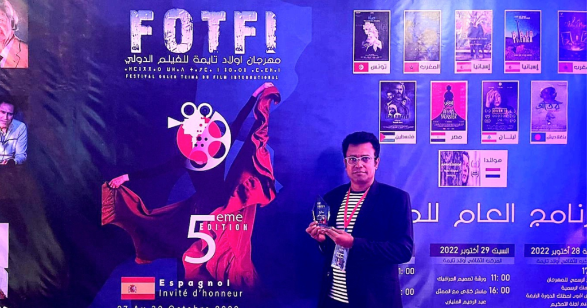

![Rana Masud,rana masud,rana masud TVC,rana masud film,rana masud short film,rana masud award,rana masud awards,rana masud production,rana masud producer,rana masud teacher,rana masud bfi,rana masud production house,rana masud festival,rana masud festivals,rana masud director,rana masud directors,rana masud film director,rana masud filmmaker,rana masud tv shows,rana masud film production,rana masud creative production,rana masud tvc production,rana masud biography,rana masud filmography,rana masud media,rana masud press,rana masud film awards,The Residence,The Fragrance,The Battles of Belonia,rana.masud.794,rana-masud-013a09156,ranamasud45,Rana_Masud4545,@ranamasud45,@FerywalaCommunications,ferywala communications,ferywala communications production,ferywala production,rana masud ferywala,rana ferywala,rana masud newas,rana masud press](./assets/cropped-Logo-Rana-Masud.png)

[Rana Masud Film Director](https://ranamasudbd.com/)

## Rana Masud Film Director

# মরক্কো উৎসবে সেরা রানা মাসুদ- Rana Masud Film Director

জনপ্রিয় বিজ্ঞাপন নির্মাতা রানা মাসুদ। এখন তিনি পুরোদস্তুর চলচ্চিত্র নির্মাতা। পূর্ণদৈর্ঘ্য চলচ্চিত্র নির্মাণ না করলেও স্বল্পদৈর্ঘ্য চলচ্চিত্রের মাধ্যমে সুনাম কুড়িয়েছেন তিনি। এর আগে ‘নিবাস’ চলচ্চিত্রের মাধ্যমে দেশ ও দেশের বাইরে বিভিন্ন চলচ্চিত্র উৎসব থেকে পরিচালক হিসেবে পুরস্কার জিতেছেন রানা মাসুদ।

এবার ‘আতর’ সিনেমার জন্য মরক্কো ওয়ালিদ তাইমা আন্তর্জাতিক চলচ্চিত্র উৎসব থেকে সেরা চিত্রনাট্যকার হিসেবে পুরস্কার জিতলেন রানা মাসুদ। ২৮ থেকে ৩১ অক্টোবর পর্যন্ত মরক্কোতে এই উৎসব অনুষ্ঠিত হয়। মরক্কো, স্পেন, ওমানসহ মোট ১০টি দেশের চলচ্চিত্র দেখানো হয় উৎসবে।

ফেনীর মাদ্রাসা ছাত্রী নুসরাত জাহানকে আগুনে পুড়িয়ে হত্যার ঘটনাকে কেন্দ্র করে নির্মিত হয়েছে আতর চলচ্চিত্রটি। এতে নুসরাত জাহানের চরিত্রে অভিনয় করেছেন রূপকথা। মাদ্রাসার প্রিন্সিপালের চরিত্রে অভিনয় করেছেন শহিদুজ্জামান সেলিম।

এ সম্পর্কে রানা মাসুদ ঢাকাপ্রকাশ-কে বলেন, ‘বাংলাদেশ থেকে ট্রানজিটসহ মোট ৪০ঘণ্টা জার্নি করে উৎসবের প্রথম দিনই অংশ নিয়েছিলাম। এত সময় জার্নি করতে একটু কষ্ট হলেও বাংলাদেশকে রিপ্রেজেন্ট করতে পেরে ভালো লেগেছে। তারা বাংলাদেশ এবং বাংলাদেশের সিনেমার প্রশংসা করেছে। ‘আতর’ চলচ্চিত্রের চিত্রগ্রহণ করেছেন রিংকন খান। সংগীত করেছেন রাহুল আনন্দ।

[SKT Filmmaker](https://www.sktthemes.org/shop/free-video-wordpress-theme/)

