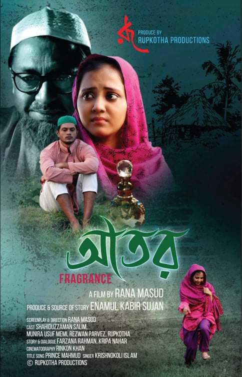

![Rana Masud,rana masud,rana masud TVC,rana masud film,rana masud short film,rana masud award,rana masud awards,rana masud production,rana masud producer,rana masud teacher,rana masud bfi,rana masud production house,rana masud festival,rana masud festivals,rana masud director,rana masud directors,rana masud film director,rana masud filmmaker,rana masud tv shows,rana masud film production,rana masud creative production,rana masud tvc production,rana masud biography,rana masud filmography,rana masud media,rana masud press,rana masud film awards,The Residence,The Fragrance,The Battles of Belonia,rana.masud.794,rana-masud-013a09156,ranamasud45,Rana_Masud4545,@ranamasud45,@FerywalaCommunications,ferywala communications,ferywala communications production,ferywala production,rana masud ferywala,rana ferywala,rana masud newas,rana masud press](./assets/cropped-Logo-Rana-Masud.png)

[Rana Masud Film Director](https://ranamasudbd.com/)

## Rana Masud Film Director

# Film Festivals

Rana Masud has both directed and produced two short films, namely “The Residence (নিবাস)” and 
“The Fragrance ( আতর)” along with a documentary titled “The Battle of Bilonia”. These films have been showcased at diverse locations both within the country and internationally.  The countries that are displayed—

[Rana Masud](https://www.imdb.com/name/nm7851085/?ref_=tt_ov_dr)

•	South Asia International Film Festival (Canada)
•	Al-Nahj International Film Festival (Iraq),
•	Cefalù film festival (Italy),
•	First-Time Filmmaker Sessions (UK)
•	Festival Ouled Teima du Film International (Morocco)
•	Second Al-Sharqiyah International Film Festival (Oman)
•	Chittagong SHORT Film Festival (Chittagong)
•	Sylhet Film Festival (Sylhet),
•	Our Shorts Their Shorts Film Festival (Dhaka)
•	Dheki International Motion Picture Festival (Dhaka)
•	Short Film Forum (Dhaka)
•	Third International Short and Documentary Film Festival Organized by Bangladesh Shilpokola Academy (Dhaka)
•	14th and 15th International Short and Independent Film Festival (Dhaka)
•	Shat Rong Short Film Festival (Nilfamary)
•	Documentary Film on the Liberation War of Bangladesh “The Battle of  Bilonia” was shown in America.
•	As a filmmaker I attend “ Bahraat Bangla Parjoton Utshab” Organized by the Government of Tripura (India)

![Rana Masud,rana masRana Masud - Filmographyud,rana masud TVC,rana masud film,rana masud short film,rana masud award,rana masud awards,rana masud production,rana masud producer,rana masud teacher,rana masud bfi,rana masud production house,rana masud festival,rana masud festivals,rana masud director,rana masud directors,rana masud film director,rana masud filmmaker,rana masud tv shows,rana masud film production,rana masud creative production,rana masud tvc production,rana masud biography,rana masud filmography,rana masud media,rana masud press,rana masud film awards,The Residence,The Fragrance,The Battles of Belonia,rana.masud.794,rana-masud-013a09156,ranamasud45,Rana_Masud4545,@ranamasud45,@FerywalaCommunications,ferywala communications,ferywala communications production,ferywala production,rana masud ferywala,rana ferywala,rana masud newas,rana masud press](./assets/the-battles-of-belonia-rana-masud.jpg)

### Categories

- Uncategorized
[Uncategorized](https://ranamasudbd.com/category/uncategorized/)

### Meta

- Log in
[Log in](https://ranamasudbd.com/wp-login.php)

[SKT Filmmaker](https://www.sktthemes.org/shop/free-video-wordpress-theme/)

