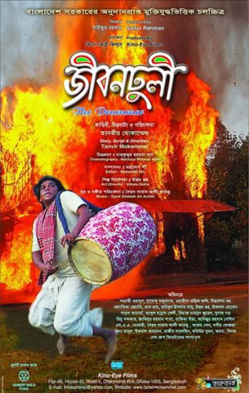
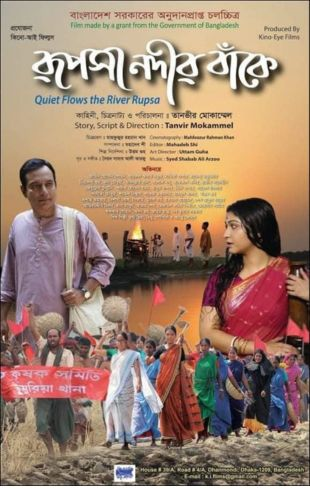
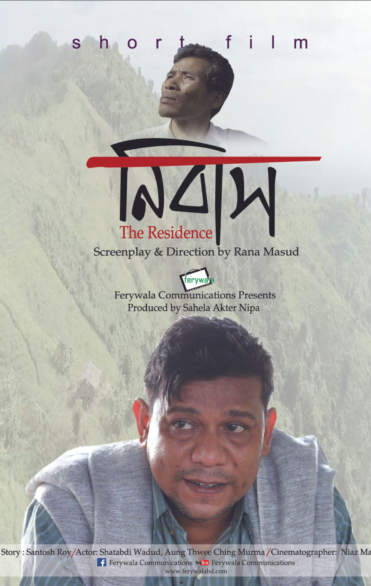

![Rana Masud,rana masud,rana masud TVC,rana masud film,rana masud short film,rana masud award,rana masud awards,rana masud production,rana masud producer,rana masud teacher,rana masud bfi,rana masud production house,rana masud festival,rana masud festivals,rana masud director,rana masud directors,rana masud film director,rana masud filmmaker,rana masud tv shows,rana masud film production,rana masud creative production,rana masud tvc production,rana masud biography,rana masud filmography,rana masud media,rana masud press,rana masud film awards,The Residence,The Fragrance,The Battles of Belonia,rana.masud.794,rana-masud-013a09156,ranamasud45,Rana_Masud4545,@ranamasud45,@FerywalaCommunications,ferywala communications,ferywala communications production,ferywala production,rana masud ferywala,rana ferywala,rana masud newas,rana masud press](./assets/cropped-Logo-Rana-Masud.png)

[Rana Masud Film Director](https://ranamasudbd.com/)

## Rana Masud Film Director

# Filmography

Rana Masud’s journey in the world of film production began with a strong foundation in theoretical knowledge. Armed with a deep understanding of film theory, including elements of cinematography, storytelling, and visual aesthetics, Masud laid the groundwork for his future success. His academic pursuits and dedication to mastering the theoretical aspects of film production set him apart as a thoughtful and strategic filmmaker. He worked as Assistant Director of internationally awarded films “Lal Shalu” “Lalon” “Bono Jatri” “Rabeya” “Jibondhuli” and “Rupsa Nodir Bake” directed by legendary filmmaker Tanvir Mokammel.

![Rana Masud,rana masud,rana masud TVC,rana masud film,rana masud short film,rana masud award,rana masud awards,rana masud production,rana masud producer,rana masud teacher,rana masud bfi,rana masud production house,rana masud festival,rana masud festivals,rana masud director,rana masud directors,rana masud film director,rana masud filmmaker,rana masud tv shows,rana masud film production,rana masud creative production,rana masud tvc production,rana masud biography,rana masud filmography,rana masud media,rana masud press,rana masud film awards,The Residence,The Fragrance,The Battles of Belonia,rana.masud.794,rana-masud-013a09156,ranamasud45,Rana_Masud4545,@ranamasud45,@FerywalaCommunications,ferywala communications,ferywala communications production,ferywala production,rana masud ferywala,rana ferywala,rana masud newas,rana masud press](./assets/rabeya-rana-masud-2.jpg)

![Rana Masud,rana masud,rana masud TVC,rana masud film,rana masud short film,rana masud award,rana masud awards,rana masud production,rana masud producer,rana masud teacher,rana masud bfi,rana masud production house,rana masud festival,rana masud festivals,rana masud director,rana masud directors,rana masud film director,rana masud filmmaker,rana masud tv shows,rana masud film production,rana masud creative production,rana masud tvc production,rana masud biography,rana masud filmography,rana masud media,rana masud press,rana masud film awards,The Residence,The Fragrance,The Battles of Belonia,rana.masud.794,rana-masud-013a09156,ranamasud45,Rana_Masud4545,@ranamasud45,@FerywalaCommunications,ferywala communications,ferywala communications production,ferywala production,rana masud ferywala,rana ferywala,rana masud newas,rana masud press](./assets/lalsalu-rana-masud.jpg)

Rana Masud’s journey extends far beyond the theoretical realm. What truly distinguishes him is his hands-on experience and practical prowess in film production and management. Masud’s career has been marked by a series of successful projects that showcase his ability to translate theoretical concepts into compelling visual narratives.
From pre-production to post-production, Masud is thoroughly involved in every stage of filmmaking. His keen eye for detail, creative intuition, and problem-solving skills have made him a sought-after professional in the industry. Whether it’s coordinating complex shoots, managing budgets, or ensuring seamless post-production processes, Masud’s practical expertise shines through in every project he undertakes.

[Rana Masud’s](https://ranamasudbd.com/biography/)

Rana Masud has both directed and produced two short films, namely “The Residence (নিবাস)” and 
“The Fragrance ( আতর)” along with a documentary titled “The Battle of Bilonia”. These films have been showcased at diverse locations both within the country and internationally.  The countries that are displayed—

[Rana Masud](https://www.imdb.com/name/nm7851085/?ref_=tt_ov_dr)

•	South Asia International Film Festival (Canada)
•	Al-Nahj International Film Festival (Iraq),
•	Cefalù film festival (Italy),
•	First-Time Filmmaker Sessions (UK)
•	Festival Ouled Teima du Film International (Morocco)
•	Second Al-Sharqiyah International Film Festival (Oman)
•	Chittagong SHORT Film Festival (Chittagong)
•	Sylhet Film Festival (Sylhet),
•	Our Shorts Their Shorts Film Festival (Dhaka)
•	Dheki International Motion Picture Festival (Dhaka)
•	Short Film Forum (Dhaka)
•	Third International Short and Documentary Film Festival Organized by Bangladesh Shilpokola Academy (Dhaka)
•	14th and 15th International Short and Independent Film Festival (Dhaka)
•	Shat Rong Short Film Festival (Nilfamary)
•	Documentary Film on the Liberation War of Bangladesh “The Battle of  Bilonia” was shown in America.
•	As a filmmaker I attend “ Bahraat Bangla Parjoton Utshab” Organized by the Government of Tripura (India)

![Rana Masud,rana masRana Masud - Filmographyud,rana masud TVC,rana masud film,rana masud short film,rana masud award,rana masud awards,rana masud production,rana masud producer,rana masud teacher,rana masud bfi,rana masud production house,rana masud festival,rana masud festivals,rana masud director,rana masud directors,rana masud film director,rana masud filmmaker,rana masud tv shows,rana masud film production,rana masud creative production,rana masud tvc production,rana masud biography,rana masud filmography,rana masud media,rana masud press,rana masud film awards,The Residence,The Fragrance,The Battles of Belonia,rana.masud.794,rana-masud-013a09156,ranamasud45,Rana_Masud4545,@ranamasud45,@FerywalaCommunications,ferywala communications,ferywala communications production,ferywala production,rana masud ferywala,rana ferywala,rana masud newas,rana masud press](./assets/the-battles-of-belonia-rana-masud.jpg)

[SKT Filmmaker](https://www.sktthemes.org/shop/free-video-wordpress-theme/)

